# 🍔 Flutter Food Delivery App  

A simple yet functional **food ordering application** built with Flutter. The app allows users to browse meals, add them to favorites, place and manage orders, and track their order status — all with a clean and interactive UI.  

---

## 🎯 Project Idea  

The main goal of this project is to simulate a **real-world food delivery experience**. Users can create an account, log in, explore categories like Burgers, Pizza, and Pasta, add meals to their favorites, and place/cancel orders. The app also provides an order history and detailed views for each item.  

---

## ⚙️ Key Features  

- ✅ **User Authentication**: Create account, login, and logout.  
- ✅ **Food Categories**: Browse meals with filters (Burgers, Pizza, Pasta).  
- ✅ **Favorites**: Add and remove favorite meals.  
- ✅ **Order Management**:  
  - Place a new order  
  - Cancel an order  
  - Track order status  
- ✅ **Profile Page**: View user information.  
- ✅ **Order History**: Access both previous and current orders.  
- ✅ **Order Details**: Dedicated page for each order.  
- ✅ Clean and modern **Arabic UI** with intuitive navigation.  

---

## 🧠 Technologies Used  

- **Flutter** (Dart)  
- **Material Design Widgets**  
- **State Management** (setState / custom logic)  
- **Custom UI Components** for modular and maintainable code  

---

## 🔮 Future Improvements
- **🌐 Backend Integration: Connect to a real-time database (Firebase / MySQL / PostgreSQL).**

- **💳 Online Payment: Integrate with a payment gateway (Stripe, PayPal).**

- **🛒 Cart System: Add multi-item cart with quantity control.**

- **🔔 Notifications: Push notifications for order status updates.**

- **🎨 UI/UX Enhancements: More advanced animations and responsive design.**

---

## 📸 Screenshots  
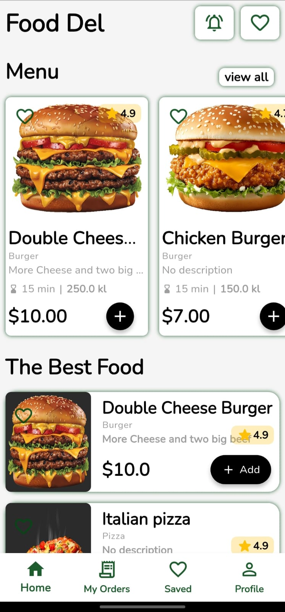
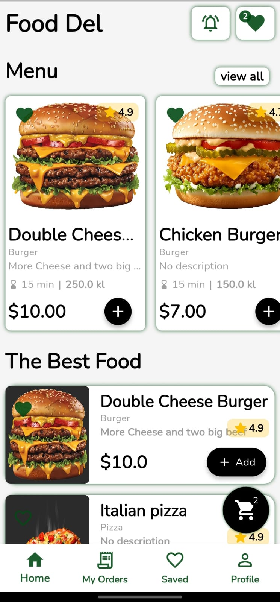
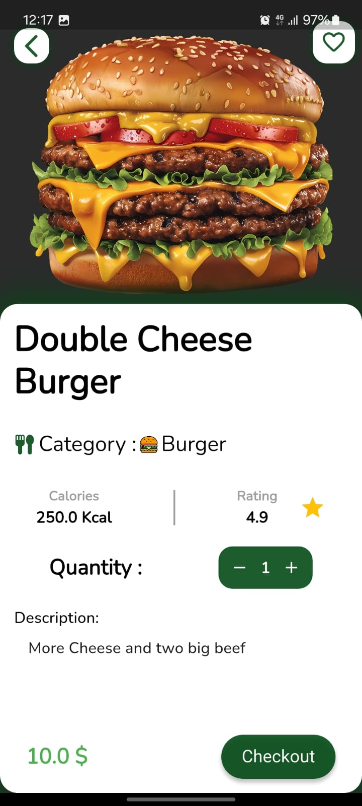
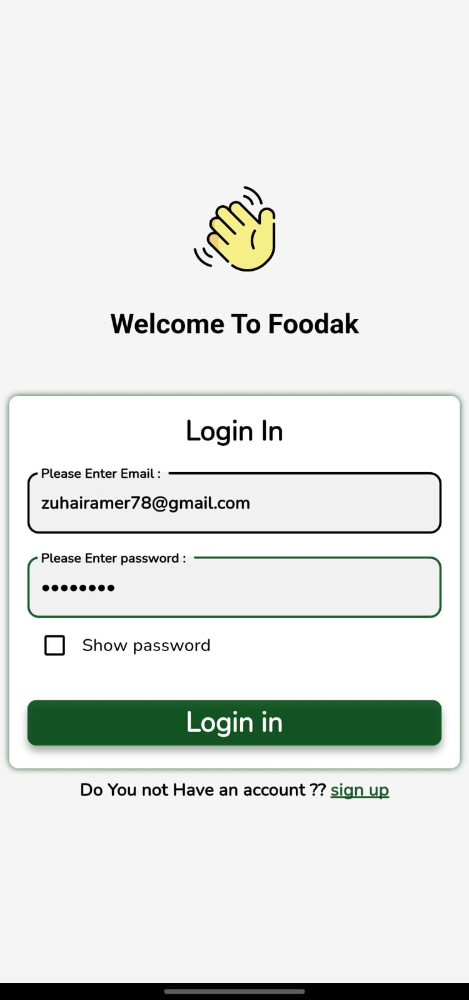
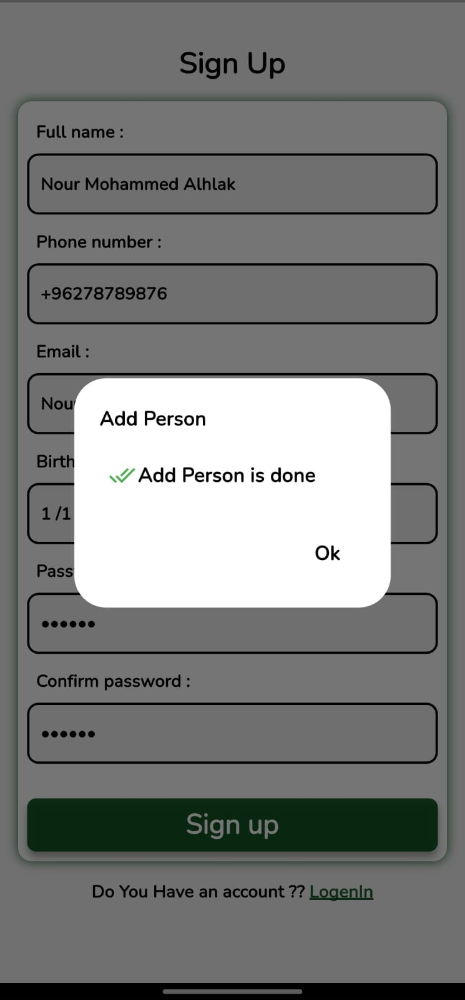
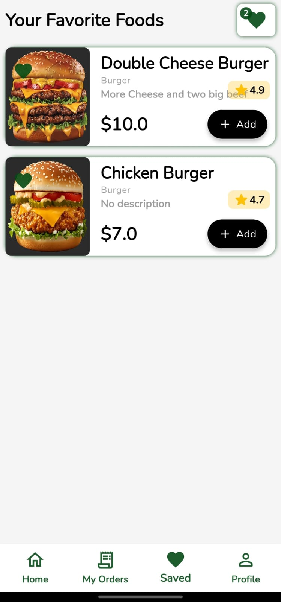
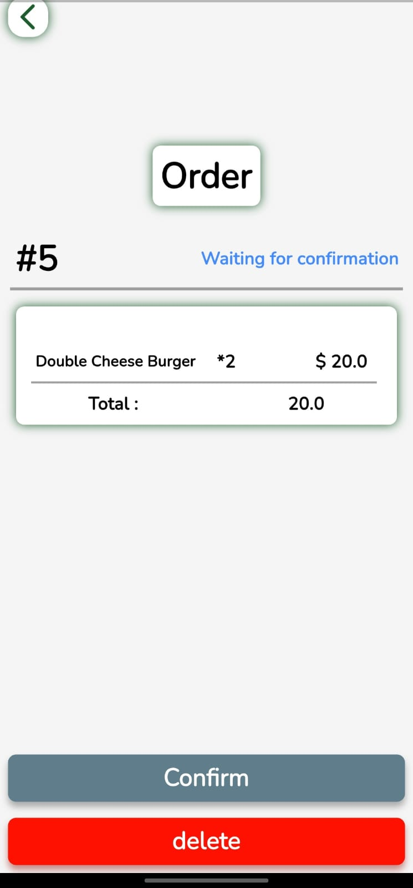
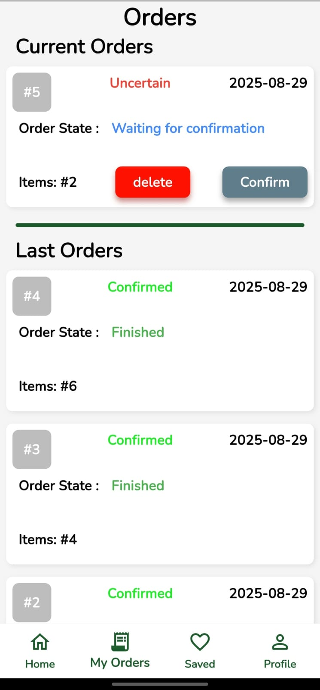
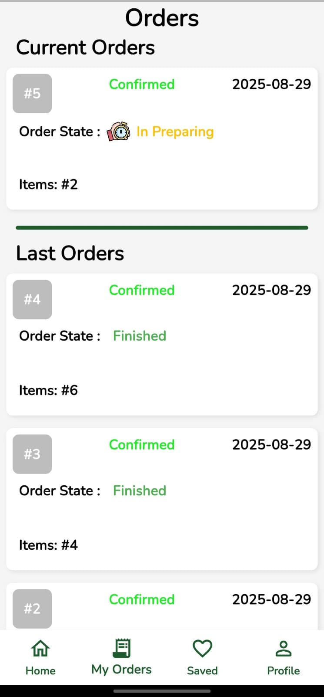
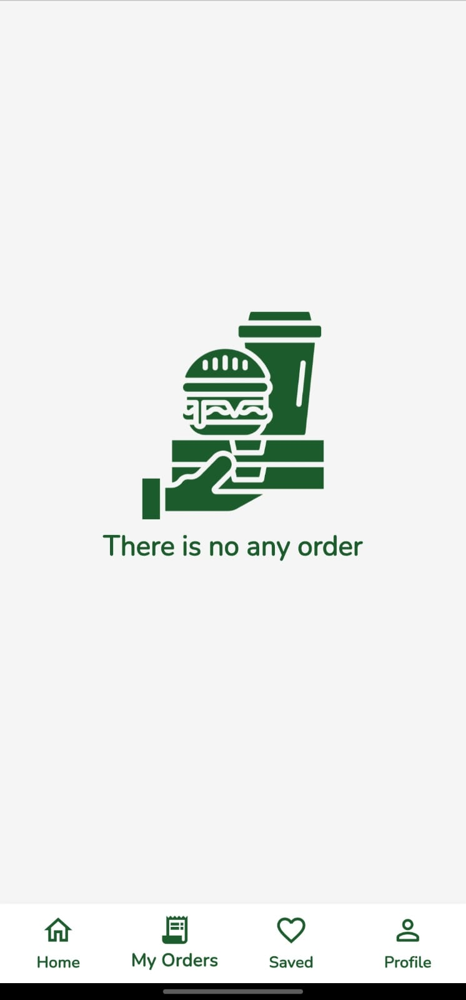
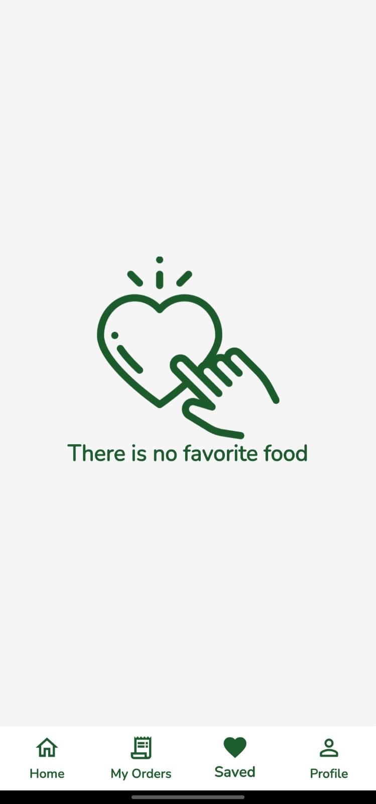


---


## 👨‍💻 Author
- **📧 Contact: [zuhairamer78@gmail.com]**
- **🌐 GitHub: zoher19**

## 🚀 How to Run  

1. Clone the repository:  
   ```bash
   git clone https://github.com/your-username/food-delivery-app.git
